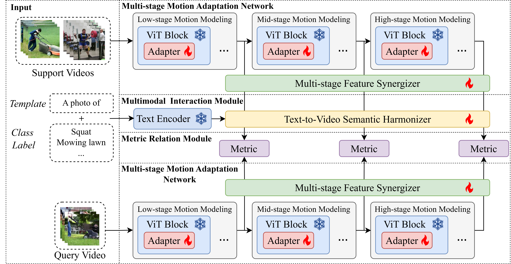

# Multi-stage Metric Learning with CLIP-based Adaptation for Few-shot Action Recognition

### PyTorch implementation of MML-FSAR



> **Multi-stage Metric Learning with CLIP-based Adaptation for Few-shot Action Recognition**<br>
> Shuo Zheng · Yuanjie Dang · Peng Chen · Ruohong Huan · Dongdong Zhao · Ronghua Liang · Qiuhong Ke
>
> **Abstract:** Utilizing the adapter tuning paradigm to adapt large-scale pre-trained models such as CLIP for few-shot action recognition can effectively enhance performance while conserving resources.
> However, this data-scarce setting exacerbates a classic dilemma between generalizability and discriminability.
> Existing methods often place excessive reliance on discriminative yet less generalizable high-level features, causing overfitting to spurious cues while neglecting the foundational motion patterns captured by more transferable low-level features.
> To address these issues, this paper proposes MML-FSAR, a Multi-stage Metric Learning Framework with CLIP-based Adaptation for few-shot action recognition, which extracts features from multiple stages of CLIP and exploits their complementary properties across abstraction levels to refine few-shot matching.
> Specifically, we integrate motion modeling modules with varying temporal receptive fields at distinct levels of the pre-trained network to facilitate fine-grained temporal relationship learning.
> Furthermore, we adopt a tailored metric learning objective that merges the generalizability of low-level local features with the discriminative power of high-level global features.
> Additionally, we introduce a fine-grained multimodal interaction module that leverages textual semantics to enhance few-shot matching.
> Extensive experiments on five benchmark datasets demonstrate that MML-FSAR achieves superior performance over state-of-the-art methods.

This repository provides the PyTorch implementation of MML-FSAR. It includes the core MML-FSAR method, split metadata for Kinetics, UCF101, HMDB51, and Something-Something V2, episode generation, and user-facing training/evaluation entry points.

## Installation

Requirements:

- Python 3.10
- PyTorch >= 2.0.0
- torchvision >= 0.15.0
- einops >= 0.6.0
- ftfy >= 6.1.1
- regex >= 2023.0.0
- numpy >= 1.24.0
- opencv-python >= 4.7.0
- Pillow >= 9.5.0
- PyYAML >= 6.0

The Python dependencies are listed in `requirements.txt`.

Create the conda environment and install dependencies:

```bash
conda create -n mml-fsar python=3.10 -y
conda activate mml-fsar
pip install -r requirements.txt
```

Run scripts from the repository root:

```bash
python scripts/train.py --help
```

## Data Preparation

Download the datasets from their original sources:

- [Kinetics](https://github.com/Showmax/kinetics-downloader)
- [UCF101](https://www.crcv.ucf.edu/data/UCF101.php)
- [HMDB51](https://serre-lab.clps.brown.edu/resource/hmdb-a-large-human-motion-database/)
- [Something-Something V2](https://developer.qualcomm.com/software/ai-datasets/something-something)

This project expects generated episode metadata and local video files. Set
`MML_FSAR_DATA_ROOT` to the directory that contains `episodes/` and `videos/`:

```bash
export MML_FSAR_DATA_ROOT=/path/to/mml-fsar-data
```

### Split Metadata

Sanitized split and video-length metadata are provided under `splits/` with dataset-relative paths. The current split metadata covers:

```text
splits/kinetics/
splits/ucf101/
splits/hmdb51/
splits/ssv2-small/
splits/ssv2-full/
```

Each dataset directory contains:

```text
length_list.json  Video path to frame-count mapping.
train_list.json   Zero-based training class id to video list mapping.
valid_list.json   Zero-based validation class id to video list mapping.
test_list.json    Zero-based test class id to video list mapping.
```

The JSON paths are relative to the corresponding local dataset video root.
Class ids in each split list are reindexed to `0..N-1` within that file. The
public training and evaluation pipeline uses JSON metadata only.

Generate few-shot episode metadata from a split JSON file. For example, generate
the Kinetics test episodes with:

```bash
python tools/generate_episodes.py \
  --split-json splits/kinetics/test_list.json \
  --output ${MML_FSAR_DATA_ROOT}/episodes/kinetics/<test-episode-json> \
  --way 5 \
  --shot 1 \
  --num-query 5 \
  --num-episodes 10000 \
  --seed 1729
```

Use the corresponding `splits/<dataset>/<split>_list.json` path and
`${MML_FSAR_DATA_ROOT}/episodes/<dataset>/` output directory for other datasets
and splits. Generated episodes use the original `ss`, `qs`, `sd`, `qd`, and
`d2c` fields with dataset-relative video paths. The repository-local
`episodes/` directory is ignored by git.

## Running

The user-facing entry points are:

```text
scripts/train.py
scripts/evaluate.py
```

Before running an experiment, check the corresponding YAML file under
`configs/experiments/` and set the dataset paths through environment variables.
`MML_FSAR_DATA_ROOT` points to generated episode JSON files, while each
`video_root` is configured as a full dataset-specific variable so frame
directories and video-file datasets can live anywhere.

The runtime expects paths like:

```text
${MML_FSAR_DATA_ROOT}/episodes/kinetics/<generated-episode-json>
${MML_FSAR_KINETICS_VIDEO_ROOT}/<dataset-relative-video-path>
```

For a Kinetics 5-way 1-shot dry run:

```bash
python scripts/train.py \
  --config configs/experiments/kinetics/kinetics_1shot.yaml \
  --dry-run
```

For a Something-Something V2 small 5-way 1-shot dry run:

```bash
python scripts/train.py \
  --config configs/experiments/ssv2-small/ssv2-small_1shot.yaml \
  --dry-run
```

Evaluation uses the same config style:

```bash
python scripts/evaluate.py \
  --config configs/experiments/kinetics/kinetics_1shot.yaml \
  --checkpoint outputs/kinetics_mml_fsar_1shot/runs/<run-id>/best_checkpoint.pt
```

When `--checkpoint` is omitted, evaluation first checks the configured
`output_dir` and then uses the newest checkpoint under `output_dir/runs/`.

## Repository Layout

```text
configs/       Dataset and experiment YAML files.
scripts/       User-facing training and evaluation commands.
src/mml_fsar/  Importable Python package.
tools/         Maintenance and inspection utilities.
assets/        Public figures and static assets.
```

## Citation

If you find this code useful, please cite our paper.

```bibtex
@article{zheng2026mmlfsar,
  title={Multi-stage Metric Learning with CLIP-based Adaptation for Few-shot Action Recognition},
  author={Zheng, Shuo and Dang, Yuanjie and Chen, Peng and Huan, Ruohong and Zhao, Dongdong and Liang, Ronghua and Ke, Qiuhong},
  journal={IEEE Transactions on Multimedia},
  year={2026}
}
```

## License

This project is released under the Apache License 2.0. See `LICENSE` for
details.
